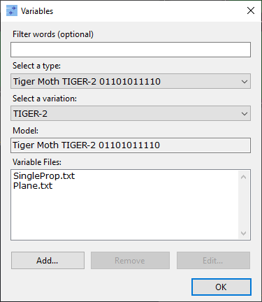
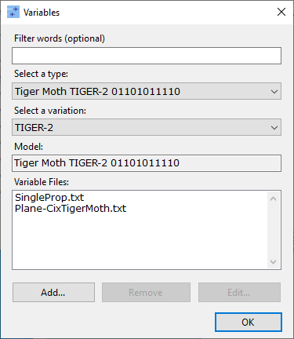

# CIX Tiger Smoke & JoinFS
A little bit of configuration is needed to get smoke working in the Tiger Moth...

## Step 1: Add The Variables file

In your `Documents` folder, you should see a folder for each version of JoinFS you have installed, one or more of:

- `JoinFS-FS2020`
- `JoinFS-FSX`
- `JoinFS-XPLANE`

Proceed with these instructions according to which version you want to setup with smoke.

Inside this `JoinFS-` folder, there is another folder called `Variables`. Inside this, there should be a number of text files: `Plane.txt`, `QuadProp.txt`, etc.

Place the file `Plane-CixTigerMoth.txt` in this folder.

You should end up with something like:

## Step 2: Configure JoinFS

Start your simulator then open the same version of JoinFS (same versions that you configured above!)

From the main window, click <kbd>File</kbd> → <kbd>Assign Variables...</kbd>

On the "Select a type" drop down list, there will be a Tiger Moth entry for each livery you have installed. Select the first <kbd>Tiger Moth TIGER-</kbd> entry.

You will see in the <kbd>Variable Files</kbd> box at the bottom, it has `SingleProp.txt` and `Plane.txt`

1. Select <kbd>Plane.txt</kbd>

2. Click <kbd>Remove</kbd>. This should remove <kbd>Plane.txt</kbd>, leaving just <kbd>SingleProp.txt</kbd>

3. Click <kbd>Add...</kbd>. A standard file chooser dialog should open.

4. Select the file <kbd>Plane-CixTigerMoth.txt</kbd> and click the <kbd>Open</kbd> button.

5. This should add `Plane-CixTigerMoth.txt` to the list of Variable Files. It should now look like: 

6. Click on the <kbd>Select a type</kbd> dropdown and select the next <kbd>Tiger Moth TIGER-</kbd> entry.

7. Repeat these steps for all <kbd>Tiger Moth TIGER-</kbd> entries in the list.

8. Finally, press the <kbd>OK</kbd> button
